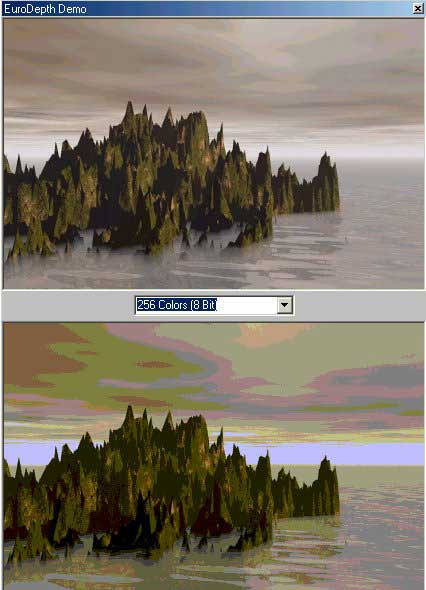



## EuroDepth \(Superior Fast Picture Color Depth Changer\)

### Description

This will change the depth of an image in the matter of milliseconds. This is as fast as PhotoShop. It includes the Visual Basic Source Code to the .dll and a demo to show how quick it is. I didn't have time to comment this. Its for a image editor I'm working on. Please leave feedback and vote if you like it. (If PSC deletes the .dll's just compile it and put one in the demo folder to run it)  -James-
 
### More Info
 

             |
---                |---
**Submitted On**   |2002-04-08 15:11:54
**By**             |[James Dougherty](https://github.com/Planet-Source-Code/PSCIndex/blob/master/ByAuthor/james-dougherty.md)
**Level**          |Advanced
**User Rating**    |4.6 (23 globes from 5 users)
**Compatibility**  |VB 6\.0
**Category**       |[Graphics](https://github.com/Planet-Source-Code/PSCIndex/blob/master/ByCategory/graphics__1-46.md)
**World**          |[Visual Basic](https://github.com/Planet-Source-Code/PSCIndex/blob/master/ByWorld/visual-basic.md)
**Archive File**   |[EuroDepth\_70116482002\.zip](https://github.com/Planet-Source-Code/james-dougherty-eurodepth-superior-fast-picture-color-depth-changer__1-33610/archive/master.zip)

